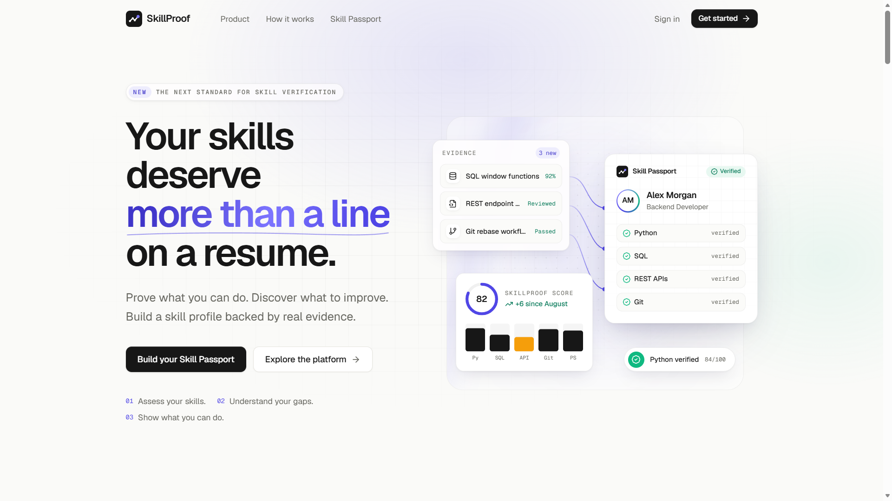
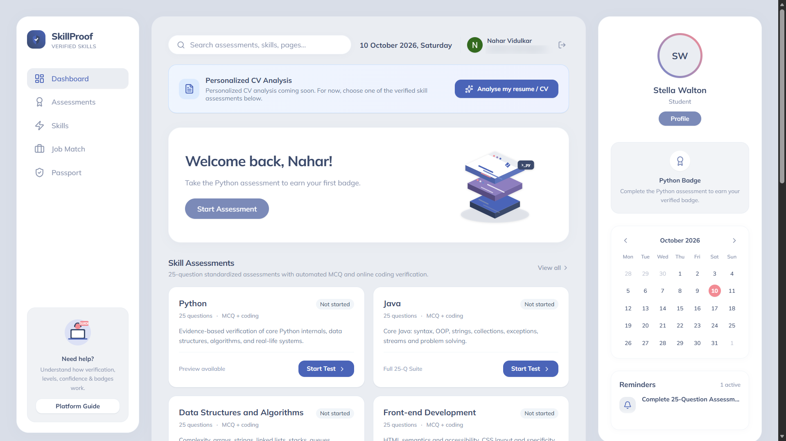
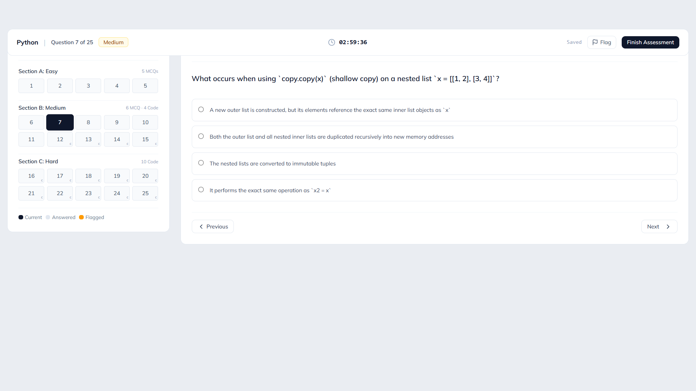
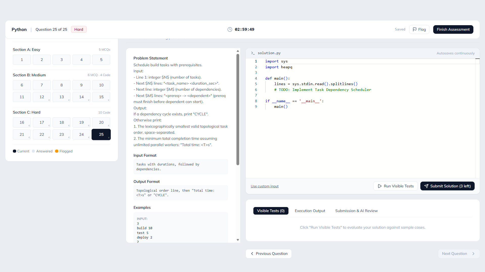

# SkillProof

**Prove your skills with tested, scored and verifiable assessments.**

SkillProof helps candidates back up what they claim on a resume. Instead of listing "Java" or "Python" with no evidence, a candidate takes a 25-question assessment that mixes multiple-choice questions with hands-on coding problems, gets a score out of 100, and builds a verifiable **Skill Passport** from the results.

> _Proof over pedigree._



**Live demo:** https://slillproof.ai.studio/

---

## Features

- **Four skill assessments:** Python, Java, Data Structures and Algorithms, and Front-end Development.
- **25 questions each:** 8 Easy, 10 Medium and 7 Hard, with 15 multiple-choice questions and 10 coding problems.
- **In-browser coding:** write code in the Monaco editor and run it against visible and hidden test cases.
- **Score out of 100:** harder questions count more, and coding problems earn partial credit.
- **Skill Passport:** results are collected into a profile that shows verified skills.
- **Authentication:** sign in with Google or with email and password (Firebase Authentication).
- **Public landing site** plus a protected private app, with an authentication gate on private routes.

## Screenshots

### Dashboard

Four fixed skill assessments, each with 25 questions, plus a profile panel, badge and reminders.



### Multiple-choice questions

A question navigator grouped by difficulty, a countdown timer, autosave and a flag option for review.



### Coding problems

A problem statement with input and output formats on the left, and the Monaco editor with Run Visible Tests and Submit on the right.



## How scoring works

Each question is weighted by difficulty: Easy = 1, Medium = 2, Hard = 3, for a maximum of 49 points per assessment. A multiple-choice answer earns its full weight when correct. A coding problem earns its weight multiplied by the share of test cases it passes.

$$
\text{Score} = \operatorname{round}\left(\frac{\text{points earned}}{49} \times 100\right)
$$

| Score     | Level      |
| --------- | ---------- |
| 85 to 100 | Expert     |
| 70 to 84  | Proficient |
| 50 to 69  | Developing |
| Below 50  | Beginner   |

Scores are calculated on the server. Correct answers, hidden test cases and reference solutions are kept on the server and are not sent to the browser.

## Tech stack

| Area           | Technology                                                                                |
| -------------- | ----------------------------------------------------------------------------------------- |
| Server         | Node.js, Express, TypeScript                                                              |
| Frontend       | HTML, CSS and JavaScript built with Vite                                                  |
| Authentication | Firebase Authentication (Google and email/password) with signed, httpOnly session cookies |
| Database       | Cloud Firestore with default-deny security rules                                          |
| Code editor    | Monaco Editor                                                                             |
| Code execution | onlinecompiler.io API                                                                     |
| AI (optional)  | Google Gemini API                                                                         |
| Hosting        | Google Cloud Run                                                                          |
| Prototyped in  | Google AI Studio                                                                          |

## Getting started

### Prerequisites

- Node.js 20 or newer and npm
- A Firebase project with **Google** and **Email/Password** sign-in enabled
- An [onlinecompiler.io](https://onlinecompiler.io) API key for running code

### 1. Clone and install

```bash
git clone https://github.com/<your-username>/skillproof.git
cd skillproof
npm install
```

### 2. Configure Firebase

1. In the Firebase Console, register a web app and copy its configuration.
2. Put the values in `firebase-applet-config.json` (project ID, API key, auth domain, app ID and so on).
3. Under **Authentication → Settings → Authorized domains**, add every domain you open the app from (for example `localhost` and your deployed domain). Sign-in fails with `auth/unauthorized-domain` if a domain is missing.
4. Create a Firestore database and publish the rules from `firestore.rules`.

### 3. Set environment variables

Create a `.env` file in the project root:

```bash
SESSION_SECRET=<a long random string>
FIREBASE_PROJECT_ID=<your-firebase-project-id>
ONLINECOMPILER_API_KEY=<your compiler api key>
GEMINI_API_KEY=<optional>
NODE_ENV=development
```

| Variable                         | Required                | Purpose                                                        |
| -------------------------------- | ----------------------- | -------------------------------------------------------------- |
| `SESSION_SECRET`                 | Yes, for sign-in        | Signs and verifies session cookies                             |
| `FIREBASE_PROJECT_ID`            | Recommended             | Firebase project identifier (falls back to the config file)    |
| `ONLINECOMPILER_API_KEY`         | For coding questions    | External code execution engine                                 |
| `GEMINI_API_KEY`                 | Optional                | Enables Gemini-powered features                                |
| `GOOGLE_APPLICATION_CREDENTIALS` | Optional                | Path to a service account file for server-side Firebase access |
| `AUTH_GATE`                      | Optional (default on)   | Set to `false` to switch off the authentication gate           |
| `NODE_ENV`                       | Recommended             | `production` serves the built files from `dist/`               |
| `PORT`                           | Optional (default 3000) | Port to listen on; Cloud Run sets this automatically           |

Generate a session secret with:

```bash
node -e "console.log(require('crypto').randomBytes(32).toString('hex'))"
```

**Never commit `.env` or any API key.** Make sure `.env` is listed in `.gitignore`.

### 4. Run locally

```bash
npm run dev
```

Open http://localhost:3000.

### 5. Build and run in production mode

```bash
npm run build
NODE_ENV=production npm start
```

The build bundles the frontend into `dist/` and the server into `dist/server.cjs`. A health check is available at `GET /api/health`.

## Deployment (Google Cloud Run)

1. Deploy the service (from AI Studio or with `gcloud run deploy`).
2. In Cloud Run, open **Edit & deploy new revision → Variables & secrets** and add the environment variables from the table above.
3. Add the service URL to Firebase **Authorized domains**.
4. Open `/api/health` to confirm the server is up.

## Security notes

- Passwords are handled by Firebase Authentication and are never stored by this app.
- Sessions use signed, httpOnly cookies.
- Firestore uses default-deny rules, and users can only access their own data.
- Answer keys, hidden test cases and solutions stay on the server.
- No secrets belong in the repository. Use environment variables.

## Roadmap

- Personalized CV analysis that detects a candidate's skills and suggests matching assessments (coming soon)
- Demo mode so visitors can try the assessments without signing in
- Shareable, verifiable Skill Passport links for recruiters
- A recruiter dashboard to search and compare verified candidates
- More languages and skill areas, and proctoring features to reduce cheating

## License

MIT. See the `LICENSE` file.
